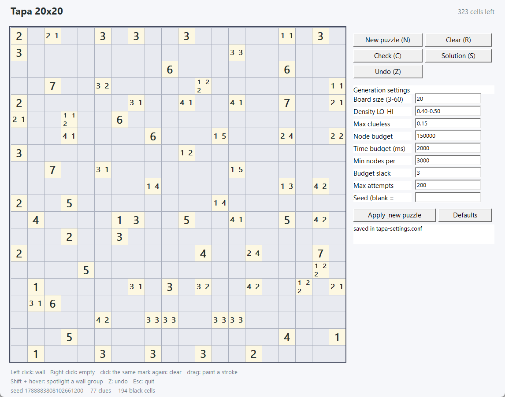

# Tapa

A Tapa puzzle game in Rust, in two flavours that share one engine: a Win32
desktop window and a browser front end that runs the same code as WebAssembly.
The only external crate is `winapi`, and only the desktop window needs it. Both
contain a rule-based solver and a generator that only ever emits puzzles whose
solution is **provably unique**.



The desktop window opens at a size taken from the desktop work area (taskbar
excluded) and centred, and it is resizable: the board takes whatever space is
left of the control column, so the cells grow and shrink with the window. Text
below and above the board is clipped to the board column, so it can never run
under the control column however small the window gets. The window cannot be
resized below the control column plus a 3x3 board at 11 pixels per cell.

```
cargo run --release                 # play in a Win32 window
cargo run --release -- --print 1    # print a puzzle + its solution
cargo run --release -- --bench 20   # time 20 generations
cargo test --workspace --release    # 54 tests, incl. uniqueness + minimality

pwsh -File build-web.ps1            # build web/tapa.wasm, then check the ABI
node tools/serve.cjs                # then open http://127.0.0.1:8080/
```

## Rules

Fill every cell black or white:

* a cell with a number is empty; the numbers are the lengths of the black runs
  around that cell, read **clockwise** starting anywhere (runs are separated by
  at least one white cell);
* all black cells form one orthogonally connected group;
* no 2x2 block is completely black.

## Controls

| input | effect |
|---|---|
| left click | mark wall (black) |
| right click | mark empty (white, shown as a small square) |
| left/right drag | paint a whole stroke; the first cell decides whether the stroke marks or clears |
| click the same mark again | clear the cell |
| left click on a white cell | switches it to wall, and vice versa |
| Z | undo (hold to repeat; one stroke = one entry per cell) |
| D | one step: fill in everything the clues alone force |
| middle click a clue | step just that one clue, without cascading |
| Alt + left click a clue | the same, for mice and trackpads without a middle button |
| drag the size slider | pick a board size; the puzzle is rebuilt when you release it |
| resize the window | the grid rescales to fill the space left of the control column |
| tap a cell (touch) | cycles the mark: wall -> empty -> unmarked |
| drag a finger (touch) | paints a stroke; the first cell decides whether it marks or clears |
| tap a clue (touch) | steps that one clue, like a middle click |
| Shift + hover | spotlight the wall group under the cursor |
| N | new puzzle |
| R | clear all marks (also undoable) |
| C | check: wrong cells get a red cross |
| S | show / hide the solution |
| Esc | quit |

Clue cells are given and cannot be edited; dragging across them simply skips
them. The board turns green when solved.

The wall count of the solution is never shown anywhere in the game - only the
seed and the number of clues are.

## Live feedback

The board tells you about broken rules while you play, without waiting for a
check:

* **spotlight** - adding a wall highlights the whole connected wall group it
  joined (blue, gold outline). Shift-hovering does the same for any group.
* **red clue** - if the walls and empty marks around a clue can no longer form
  its numbers, the clue turns red.
* **red walls** - a wall group that can never join the main wall group any more,
  because every cell between them is marked empty, is outlined in red. Groups
  that are only separate *for now* (undecided cells still connect them) are left
  alone.
* **red 2x2** - any 2x2 block of walls is outlined in red.

The status bar adds `red = rule broken` whenever something is flagged.

## One step

There are two granularities. **Middle-clicking a clue cell** applies the rule to
that single clue once - no cascading - which is handy for poking at one number.
The **One step (D)** button applies only the rule *"the black runs around a clue
must match its numbers"* to the cells around each clue, to a fixpoint, and marks
everything that follows from it. It never uses search or the connectivity rule,
so it is always sound: every cell it fills is forced. On a dense 20x20 board
this typically fills 100-250 cells; press it again and it usually finds nothing
new, because the first press already reached the fixpoint.

## Controls and settings in the UI

The window has two halves: the board on the left and an always-visible control
column on the right. Every action is a button there - New puzzle (N), Clear
(R), Check (C), Solution (S), Undo (Z) and One step (D) - and the generation
settings are editable in place. There is no menu to open: everything is on
screen, and hovering a setting shows what it means in the help line at the
bottom of the column.

The buttons and the keyboard shortcuts do the same thing. Changing a setting
and pressing **Apply & new puzzle** validates it with the same code the config
file uses, saves it, and starts a new puzzle; changing the board size re-fits
the grid in the current window (and grows the window if the new board would not
fit). **Defaults** refills the fields.

The board size has a **slider** under its field: dragging it updates the number
live and rebuilds the puzzle when you let go, so you can sweep through sizes
without typing. The browser build has the same slider next to the size field.

| setting | default | meaning |
|---|---|---|
| `size` | 20 | board is `size x size` (3..60) |
| `seed` | clock | fixed seed; makes generation reproducible |
| `density` | `0.50-0.60` | fraction of black cells, picked randomly in this range |
| `max_clueless_fraction` | 0.15 | reject shapes whose biggest clue-free patch exceeds this fraction of the board |
| `node_budget` | 150000 | nodes for one whole generation, shared adaptively |
| `time_budget_ms` | 2000 | milliseconds for one whole generation |
| `check_min_nodes` | 3000 | floor for a single uniqueness proof |
| `check_slack` | 3 | how much one proof may borrow over its fair share |
| `max_attempts` | 200 | how many shapes to try before giving up |

The same settings can be set from a file or the command line:

```
tapa --config tapa.conf                  # play with those settings
tapa --config tapa.conf --set size=24    # override a single line
tapa --size 16 --density 0.35-0.45       # or set everything on the command line
tapa --print 3 --size 14 --seed 42       # generate without the GUI
```

`tapa.conf` in this directory is a documented example; `tapa --help` prints it.
Settings changed in the game are remembered in
`%APPDATA%\tapa\settings.conf` (falling back to `tapa-settings.conf` next to the
working directory when that is not writable).

### How the budget behaves

The budget is a **shared pool, not a hard per-proof cap**: each uniqueness proof
gets `remaining / proofs left * check_slack` nodes, so one that needs a little
more than its fair share can still finish. A proof that does run out keeps its
clue and is retried once at the end with whatever budget is left. Running out of
budget never breaks uniqueness - it only leaves a redundant clue in place.

Measured on this machine: 12x12 generates in ~15 ms, 20x20 in ~1.0 s average,
30x30 in 5-10 s (it needs a larger `node_budget` to stay minimal).

## Web front end (WebAssembly)

The engine - generator, solver, rules, one-step deduction - compiles to
WebAssembly and runs inside a Web Worker, so the page never blocks, not even
while a 20x20 puzzle is being generated and its uniqueness proved. The
JavaScript is a pure view: it draws the board on a canvas, turns mouse and
keyboard into command strings, and renders whatever state the engine reports.

```
pwsh -File build-web.ps1     # cargo build --target wasm32-unknown-unknown + copy
node tools/serve.cjs         # static server on http://127.0.0.1:8080/
node tools/wasm-smoke.cjs    # drive the ABI from Node, no browser needed
node tools/browser-check.cjs # drive the real page in headless Chrome
```
`web/` is plain HTML/CSS/JS with no build step and no dependencies. The module
is loaded by hand rather than through `wasm-bindgen`, which is not available
offline: `tapa-wasm` exports a scratch buffer for the command text plus a JSON
reply buffer, and `web/worker.js` copies commands in and parses replies out. The
only requirement is the `wasm32-unknown-unknown` standard library, which
`build-web.ps1` adds if it is missing.

The page is translated: Simplified Chinese by default, English one click away in
the header, and the choice is remembered. The engine never sends prose for the
player to read - it reports a status *key* with its numbers (`statusKey`,
`statusArgs`) and structured generation statistics (`genStats`), so every line
in the UI, including the rules introduction under the title, comes from
`web/i18n.js`.

Two details keep a deploy from breaking a page that is already open. GitHub
Pages caches everything for ten minutes, so the workflow stamps the commit sha
into the asset URLs (`?v=...` on the stylesheet, both scripts and the wasm): a
freshly fetched page always asks for matching scripts instead of reusing ones
the browser cached from an earlier deploy. And every translatable element
carries its Chinese text inline in the HTML, so a page whose scripts are stale
or blocked still reads correctly instead of showing empty buttons.

Everything the desktop game does is in the browser too, including a touch
build: a finger that taps a cell cycles it wall -> empty -> unmarked, a finger
that travels paints a stroke, and tapping a clue steps just that clue, so no
middle button is needed.

| feature | where |
|---|---|
| left click wall / right click empty / click again to clear | canvas pointer events |
| tap a cell to cycle wall -> empty -> clear, drag to paint | `tap` command, `TAP_MOVE_PX` in `web/app.js` |
| tap a clue to step it | `tap` falls through to `cluestep` |
| drag a whole stroke, gaps filled in | `line_cells` in the engine |
| wall-group spotlight on paint, and on Shift + hover | `floodFill` in `web/app.js` |
| red clues, red sealed-off walls, red 2x2, red wrong cells | `live_errors` in the engine, drawn as outlines |
| a small square for an explicit empty mark | canvas |
| N / R / C / S / D / Z keys, hold Z to repeat | window key handlers |
| middle click a clue to step only that clue | `cluestep` command |
| Alt + click, or the "Step one clue" button, for the same thing | `stepClue` in `web/app.js` |
| size slider, window resize rescales the canvas | `layout()` in `web/app.js` |
| settings with hover help, remembered between visits | `localStorage`, fields built from the engine's `FIELDS` |
| no wall count anywhere in the UI | the state the engine reports never contains one |
| `--print` / `--bench` | Print and Bench buttons, same text as the CLI |

`tools/browser-check.cjs` drives the real page in headless Chrome with real
input events: it paints, drags, undoes, steps a clue, checks every deduction
against the solution, spotlights a group, resizes the board, checks that
settings survive a reload, and confirms the page still answers in milliseconds
while the worker is benching. It writes `web-check.png` so the layout can be
inspected by eye.

## Deploying the web build

`web/` is a static site: `index.html`, `style.css`, `app.js`, `worker.js` and
the compiled `tapa.wasm`. Any static host will do. For GitHub Pages,
`.github/workflows/pages.yml` rebuilds the module from source, runs the tests
that do not need Windows, checks the ABI, and publishes `web/`:

1. push `main` (the workflow runs on every push and can also be started by hand),
2. **Settings -> Pages -> Build and deployment -> Source: GitHub Actions**,
3. open `https://<user>.github.io/<repo>/`.

Every path in the page is relative, so it works from a project subpath as well
as from a domain root. Pages serves `.wasm` as `application/wasm`, and the
loader falls back to `WebAssembly.instantiate` on a plain byte array if a host
gets the type wrong.

GitHub Pages on a **private** repository needs GitHub Pro; on a free account the
repository has to be public. Serving it locally needs neither:

```
node tools/serve.cjs                 # http://127.0.0.1:8080/
node tools/serve.cjs 8081 some/dir   # serve another directory on another port
```

## Code map

| file | contents |
|---|---|
| `core/src/model.rs` | grid geometry, cell states, clue encoding (`mask -> run lengths`), rule validation, live rule analysis, one-step deductions |
| `core/src/solver.rs` | propagation + backtracking search, capped solution counting |
| `core/src/generator.rs` | tree-shaped solution, maximal clue set, minimisation to a minimal set |
| `core/src/config.rs` | generation settings (file, command line, in-game controls) |
| `core/src/clock.rs` | monotonic milliseconds: `Instant` natively, a host import in wasm |
| `core/src/report.rs` | the text of `--print` / `--bench`, shared with the browser |
| `core/src/text.rs` | board rendering as text |
| `core/src/rng.rs` | splitmix64 PRNG (no dependency, reproducible seeds) |
| `src/render.rs` | GDI drawing, double buffered |
| `src/window.rs` | Win32 window, app state, undo stack, input handling |
| `src/settings_ui.rs` | the always-visible control column |
| `src/cli.rs` | `--print` / `--bench` |
| `wasm/src/lib.rs` | game state plus the command/JSON bridge, compiled to WebAssembly |
| `web/index.html`, `web/style.css`, `web/app.js`, `web/worker.js` | the browser front end |
| `web/i18n.js` | the Simplified Chinese and English strings |
| `tools/*.cjs` | static server, wasm ABI smoke test, headless-browser check |
| `tools/native-check.ps1` | desktop GUI check: posts real mouse messages and compares screenshots |
| `build-web.ps1` | builds and installs `web/tapa.wasm` |

## How the solver works

Search is depth-first backtracking, but almost all the work is done by
propagation, which runs to a fixpoint before every branch:

1. **clue cells are empty** - forced;
2. **arc consistency per clue** - every clue has a precomputed set of legal
   8-neighbour bitmasks (filtered for cells outside the grid, which can never
   be black). The surviving set is kept as a 256-bit bitset, so "which patterns
   still fit" is a handful of AND instructions; a neighbour that is black
   (white) in *all* surviving patterns is assigned. If nothing survives, the
   branch is dead;
3. **no 2x2 black** - three black cells force the fourth white. Only the four
   windows around a cell that just turned black are examined;
4. **connectivity** - the cells that could still become black are split into
   orthogonal components. All black cells must end up in one component, so once
   one component contains a black cell, every other component is forced white.
   Two components containing black cells is a contradiction.

Branching is **not** on single cells: the solver picks the clue with the fewest
surviving patterns and branches on those patterns, which assigns up to eight
cells at once. Only when every clue is fully determined does it fall back to
picking the most constrained single cell.

Uniqueness is decided by counting solutions with the cap set to 2: exactly one
solution *found and proven* (not "aborted by budget") means unique.

## How the generator works

1. **grow a random solution whose black cells form a tree.** Each new black cell
   must touch the existing region on exactly one side, so the black cells are an
   acyclic connected set. That single rule gives every structural constraint
   Tapa needs for free: a 2x2 block, a black cell surrounded by black cells and
   a white cell ringed by black cells (a clue of 8) all contain a cycle.
   Growth is aimed at the white area currently furthest from the tree, and while
   any border is still untouched it is aimed at that border instead, so the
   black region always reaches all four edges rather than floating in a white
   margin. Black density is 50-60%, which keeps the leftover white patches
   small.
2. **take the maximal clue set**: every white cell that touches black becomes a
   clue, except cells whose clue would be 8. If this set does not already have a
   unique solution, the shape is unusable (subsets are only weaker) and a new
   shape is grown.
3. **minimise to a minimal clue set**: walk the candidates in random order and
   drop a clue whenever the puzzle still has exactly one solution. Every kept
   clue was tested against a superset of the final set, so the result is
   *inclusion-minimal*: no single clue of it can be removed any more.

### Why not "start blank and add clues until the solution is unique"?

That construction is natural and it is what the generator effectively checks for
every clue it keeps, but the adding direction does not give a minimal set: it
only guarantees that each clue was needed *at the moment it was added*, and
later clues can make earlier ones redundant. Measured on the same shapes, adding
random clues until unique needs **117-164** clues, while removing from the
maximal set down to minimal needs **69-83**. The adding direction is also slower
here, because its intermediate puzzles are nearly unique - exactly where the
solver has to search hard - whereas the removing direction mostly works on dense
puzzles that are refuted quickly.

Every puzzle is *verified* unique, the stored solution is the one the shape
started from, and clues of 8 never appear (a 0 cannot occur either: a clue is
only placed where black already touches).

## Measured performance

Windows, `--release`, 20x20, 20 seeds:

| metric | result |
|---|---|
| generation time | 40-780 ms, ~135 ms average, 0 failures |
| clues per puzzle | 68-79 (inclusion-minimal) |
| black cells | 201-236 of 400 (50-59%) |
| biggest clue-free patch | up to 24 cells (6% of the board) |
| edges reached | 4 of 4 on every puzzle (40 seeds) |
| shapes tried per puzzle | 1 |
| test suite | 54 tests, ~0.2 s release |

The same engine in WebAssembly (`web/tapa.wasm`, 144 KiB, Chrome 152) generates
a 20x20 in the same ballpark; the page itself stays interactive throughout,
because all of it runs on a worker thread.

The clue count is high because the numbers have to cover the whole board *and*
the set has to stay minimal. Dense boards are also what make the solver fast:
the harder a puzzle is constrained, the quicker a uniqueness proof finishes. At
the 0.40-0.50 density this generator used to ship, a 20x20 averaged a second and
occasionally took three; at 0.50-0.60 the same board averages 135 ms, so the
denser default is both prettier and faster.

## Limitations

* The generator is tuned for 20x20; other sizes work but were only spot-checked.
* "Minimal" here means *inclusion*-minimal (no single clue is removable), which
  greedy removal guarantees; it is not proven to be the smallest possible clue
  set for that solution. When the budget runs out, a removable clue can also
  survive. The unit tests check strict minimality with the budgets disabled.
* One step only uses the clue rule, so it can leave cells that the connectivity
  or 2x2 rules would force.
* The solver has no clause learning or restarts; hard instances are bounded by
  the shared budget rather than solved quickly.
* The desktop build is Windows only (Win32 + GDI). The engine and the browser
  front end are not: they only need `wasm32-unknown-unknown`.
* The browser build needs a static server; `file://` cannot fetch WebAssembly.
  `tools/serve.cjs` is that server, with no dependencies.
* No network access was available while this was written, so the only dependency
  is `winapi`, which was already in the local cargo cache. That is also why the
  wasm bridge is hand-written instead of using `wasm-bindgen`.

